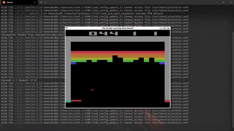
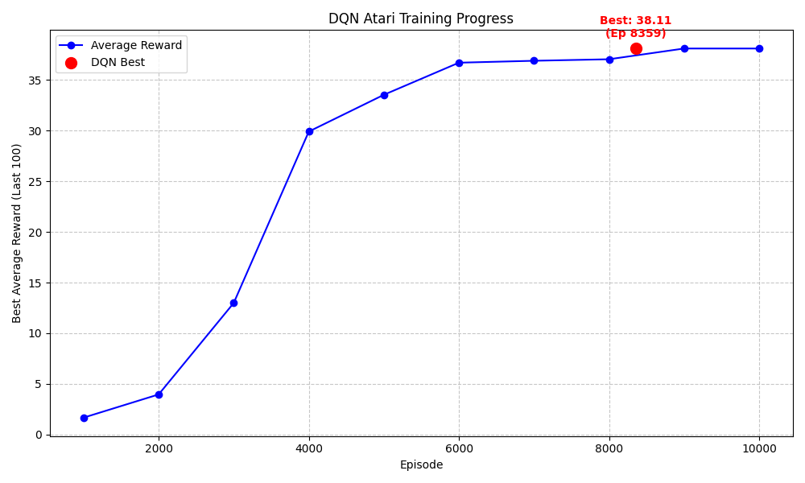

# DeepMind Atari DQN

> A clean, first-principles implementation of DeepMind's seminal 2015 Deep Q-Network (DQN) architecture in PyTorch, designed to play Atari Breakout.

[](https://opensource.org/licenses/MIT)
[](https://www.python.org/downloads/)
[](https://pytorch.org/)





## Why This Exists

Reinforcement learning codebases are notoriously difficult to read because they often obscure the core algorithms behind layers of abstraction, runners, and configuration managers. This project is built differently. It implements DeepMind's original DQN algorithm from scratch, prioritizing mathematical clarity and readable code. If you want to understand exactly how an agent learns to beat an Atari game utilizing Experience Replay and a Convolutional Neural Network—without abstracting away the Bellman Equation—this repository is for you.

## Quick Start

The fastest way to get the agent training on Breakout:

```bash
# 1. Clone the repository and navigate inside
cd deepmind-atari-dqn

# 2. Create and activate a virtual environment
python3 -m venv venv
source venv/bin/activate  # Or `venv\Scripts\activate` on Windows

# 3. Install dependencies
pip install -r requirements.txt

# 4. Start the training loop
python train.py
```

## Installation

**Prerequisites**: Python 3.8+

1. Set up your environment:
```bash
python3 -m venv venv
source venv/bin/activate
```

2. Install the required packages. The `gymnasium[atari]` and `gymnasium[accept-rom-license]` flags are required to download the Atari ROM environments:
```bash
pip install gymnasium[atari] gymnasium[accept-rom-license] torch opencv-python numpy
```
*(Alternatively, simply run `pip install -r requirements.txt`)*

> **Tip for GPU Optimization**: Training a DQN on a CPU takes days. It is highly recommended to install a CUDA-enabled version of PyTorch. Check your version with `nvidia-smi` and install the corresponding PyTorch wheel from [the official site](https://pytorch.org/get-started/locally/).

## Usage

### Training the Agent

To start a fresh training session, simply run `train.py`. The script will automatically detect if a CUDA-capable GPU is available and use it.

```bash
python train.py
```

The training process uses a linear $\epsilon$-greedy decay strategy and Huber Loss for stability. It will periodically output the agent's performance (Average Reward, Epsilon, Loss) to the console and save model weights to a `checkpoints/` directory.

### Results

The agent's progress is tracked via the rewards obtained during training. Below is the learning curve extracted from the training checkpoints, showing the improvement in average reward over time.



### Evaluating a Trained Agent

Once you have a mature checkpoint (or to watch the agent play out its best game), use the `evaluate.py` script. By default, it will visually render the game screen.

```bash
python evaluate.py
```

### Configuration

You can tweak the agent's hyperparameters directly in the `train.py` or agent initialization:

| Option | Default | Description |
|--------|---------|-------------|
| `env_name` | `BreakoutNoFrameskip-v4` | The Gymnasium Atari environment |
| `batch_size` | `32` | Number of experiences sampled per training step |
| `gamma` | `0.99` | Discount factor for future rewards |
| `epsilon_start` | `1.0` | Initial exploration rate |
| `epsilon_end` | `0.1` | Final exploration rate |
| `buffer_capacity` | `100_000` | Maximum size of the experience replay buffer |
| `target_update_freq` | `10_000` | Steps between syncing the target network |

## Project Architecture

This project is logically divided into 5 phases that work together to form the DQN:

1. **`preprocessing.py`**: Handles incoming game frames, converts them to grayscale, resizes them to 84x84, and stacks 4 consecutive frames so the agent can perceive motion.
2. **`replay_buffer.py`**: A memory structure (using a `deque`) that stores the agent's past experiences `(state, action, reward, next_state, done)` for $O(1)$ batch sampling.
3. **`dqn_network.py`**: A PyTorch Convolutional Neural Network (CNN) that acts as the "eyes," mapping graphical data to predicted Q-Values for possible joypad actions.
4. **`agent.py`**: The "brain". Handles action selection based on the $\epsilon$-greedy policy, calculates target Q-values utilizing the Bellman Equation, and syncs the Online and Target networks.
5. **`train.py` / `evaluate.py`**: The training loop that orchestrates the environment interactions and the rendering loop to watch the trained agent.

For a deeper dive into the first-principles math and comprehensive architectural explanation, refer to the [Deepmind's Atari Project Documentation](<Deepmind's Atari Project.md>).

## Contributing

Pull requests are welcome. For major changes involving new algorithms (e.g., Double DQN, Dueling DQN), please open an issue first to discuss the scope.

## License

This project is licensed under the MIT License - see the LICENSE file for details.
